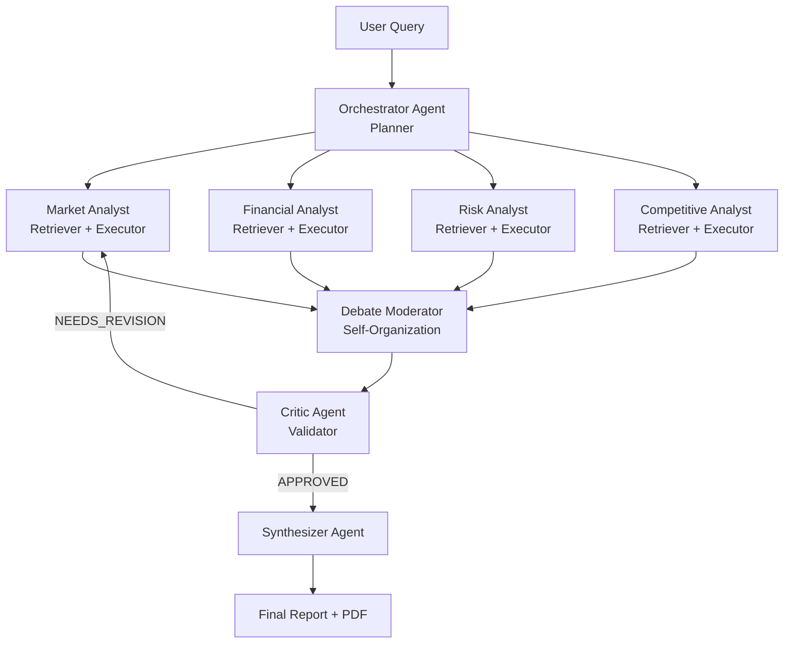

# SwarmIQ — Architecture Reference

## Pipeline Diagram

---

## Agent Swarm Map

| Agent Name | Swarm Role | Input | Output | Microsoft Tool Used |
|---|---|---|---|---|
| **Orchestrator** | Planner | Raw user query string | Four targeted sub-task strings (`market_task`, `financial_task`, `risk_task`, `competitive_task`) as JSON | Azure OpenAI gpt-4o (JSON mode) |
| **Specialist Analysts** (Market · Financial · Risk · Competitive) | Retriever + Executor | Sub-task string + company name | Structured JSON: `{agent, findings, key_metrics, sources, confidence}` — runs 2 Tavily searches then reasons over results | Azure OpenAI gpt-4o + Tavily web search |
| **Debate Moderator** | Self-Organization | All four specialist output dicts | Structured debate transcript with `conflict_topic`, `debate` turns, and `resolution` string | Azure OpenAI gpt-4o (JSON mode) |
| **Critic** | Validator | All specialist outputs + debate resolution + optional revision context | `{status, contradictions, issues, flagged_agents, overall_confidence, notes}` — triggers revision loop if `NEEDS_REVISION` | Azure OpenAI via **Semantic Kernel** `ChatCompletionAgent` + `AgentGroupChat` |
| **Synthesizer** | Reporter | All specialist outputs + critic review (post-revision) | Final 8-section markdown report: Executive Summary → Recommendation → Confidence Score, with per-agent attribution | Azure OpenAI via **Semantic Kernel** `ChatCompletionAgent` + `AgentGroupChat` |
