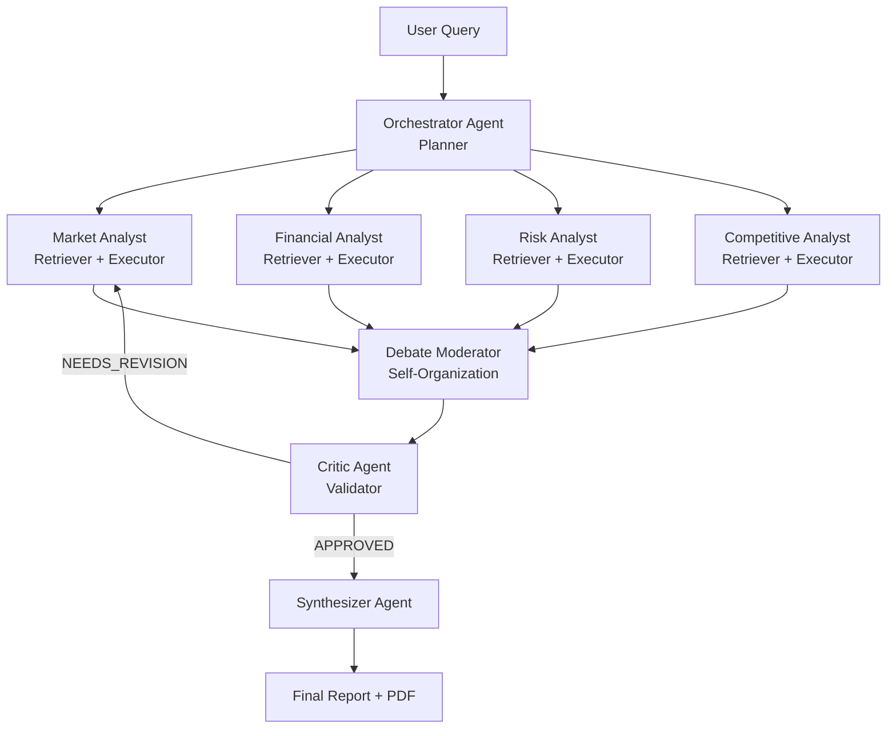

# SwarmIQ — Architecture Reference

## Pipeline Diagram

---

## Agent Swarm Map

| Agent Name | Swarm Role | Input | Output | Microsoft Tool Used |
|---|---|---|---|---|
| **Orchestrator** | Planner | Raw user query string | Four targeted sub-task strings (`market_task`, `financial_task`, `risk_task`, `competitive_task`) + `agents_needed` array for dynamic specialist selection, as JSON | GitHub Models `openai/gpt-4o-mini` (JSON mode) via Microsoft-hosted endpoint — drop-in swap to direct Azure OpenAI Foundry (`swarmiq-openai-vaani` already provisioned in `swarmiq-rg`) by changing three env vars, zero code changes |
| **Specialist Analysts** (Market · Financial · Risk · Competitive) | Retriever + Executor | Sub-task string + company name | Structured JSON: `{agent, findings, key_metrics, sources, confidence}` — runs 2 Tavily searches then reasons over results | GitHub Models `openai/gpt-4o-mini` + Tavily web search (only the 2–4 specialists picked by the Orchestrator's dynamic selection actually run) |
| **Debate Moderator** | Self-Organization | All four specialist output dicts | Structured debate transcript with `conflict_topic`, `debate` turns, and `resolution` string | GitHub Models `openai/gpt-4o-mini` (JSON mode) |
| **Critic** | Validator | All specialist outputs + debate resolution + optional revision context | `{status, contradictions, issues, flagged_agents, overall_confidence, notes}` — triggers revision loop if `NEEDS_REVISION` | **Microsoft Semantic Kernel** `AgentGroupChat` + `ChatCompletionAgent`, wired to GitHub Models via a custom `AsyncOpenAI` client |
| **Synthesizer** | Reporter | Compacted specialist outputs + critic verdict-as-prose + optional revision context | Final 8-section markdown report: Executive Summary → Recommendation → Confidence Score, with per-agent attribution, no JSON blocks | **Microsoft Semantic Kernel** `AgentGroupChat` + `ChatCompletionAgent`, wired to GitHub Models via a custom `AsyncOpenAI` client |
