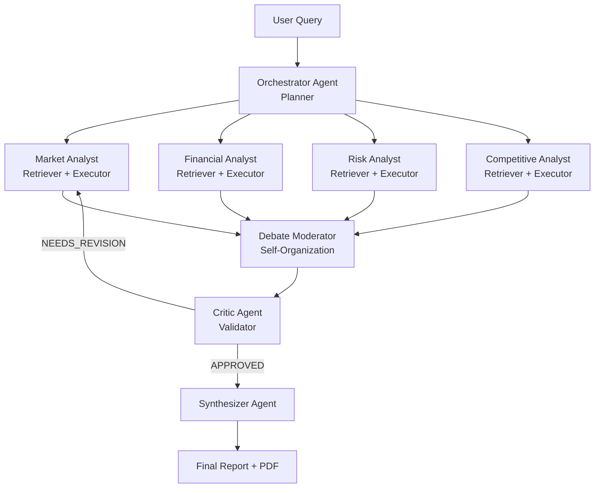

# SwarmIQ — AI-Powered Investment Research Swarm

> A swarm of 7 specialized AI agents that researches, debates, and synthesizes investment intelligence in under 60 seconds.

---

## Microsoft Build AI 2026 — Theme 05: Agent Swarms

SwarmIQ is built specifically for **Theme 05: Agent Swarms** — a system where multiple AI agents collaborate, self-organize, and collectively produce outputs no single agent could achieve alone. The mapping is explicit: the **Orchestrator** acts as the swarm planner (decomposes the query into directed sub-tasks), the four **Specialist Analysts** are retriever-executors (each searches and reasons independently in parallel), the **Debate Moderator** provides self-organization (surfaces conflicts between agents and forces consensus before escalation), and the **Critic** is the validator (adversarially reviews all outputs and triggers a revision loop when quality is insufficient).

---

## The Problem

- **Investment research is slow and expensive.** A professional equity research report takes 2–5 analyst-days and costs thousands of dollars — putting institutional-grade analysis out of reach for individual investors, early-stage founders, and small funds.
- **Single-perspective analysis is dangerously incomplete.** Most AI tools answer with one model, one viewpoint. Market opportunity, financial health, competitive threats, and regulatory risk require genuinely different reasoning lenses — and those lenses often conflict.
- **Conflicts between data sources go unresolved.** When one source says a company is growing and another flags its burn rate as unsustainable, a single-agent system has no mechanism to surface or resolve that contradiction. SwarmIQ does.

---

## Our Solution

SwarmIQ sends a user query through a structured, multi-stage swarm pipeline. First, the **Orchestrator** reads the query and decomposes it into four specialized research tasks — each crafted to elicit the right kind of analysis from the right kind of expert. Those four tasks are dispatched simultaneously to four **Specialist Analysts** (Market, Financial, Risk, and Competitive) who each run live web searches via Tavily and reason over the results independently. As specialist outputs complete, they are streamed live to the browser so users can watch the swarm think in real time.

Once all specialists finish, the **Debate Moderator** scans for contradictions between outputs — if the Market Analyst sees explosive growth while the Financial Analyst flags severe cash burn, that conflict is surfaced as a structured debate visible in the UI. The agents exchange points until a resolution is reached. The consolidated outputs then go to the **Critic** (powered by Semantic Kernel's `AgentGroupChat`) which adversarially reviews every claim: checking for contradictions, unsupported assertions, and suspicious gaps. If quality is insufficient, the Critic triggers a targeted revision — only the flagged specialists re-run, with explicit issue context. Finally, the **Synthesizer** writes a structured executive report with eight named sections, confidence scores, and agent attribution. The whole pipeline completes in under 60 seconds.

---

## Microsoft Stack Used

| Tool | How We Use It | Why It Matters |
|---|---|---|
| **Azure OpenAI** (gpt-4o deployment) | Powers all 7 agents — orchestration, research, debate, critique, and synthesis | Microsoft-first AI stack; enterprise SLA, data residency guarantees |
| **Semantic Kernel** v1.x | `AgentGroupChat` orchestrates the Critic ↔ Synthesizer exchange; `ChatCompletionAgent` wraps each SK agent with structured instructions | Production-grade agentic framework — not a hand-rolled loop |
| **Azure Cosmos DB** | Stores per-user analysis history (MongoDB-compatible API, accessed via Motor async driver) | Serverless, globally distributed, scales to zero — no cold-start cost |
| **Azure Container Apps** | Production hosting target — two app replicas, shared Redis sidecar, auto-scaling to zero | No infrastructure management; built-in HTTPS, custom domains, scaling |
| **Microsoft Entra External ID** | MSAL.js popup auth; ID tokens validated server-side via JWKS; `oid` claim used as stable user key | Standards-based identity with no password management or user table |

---

## Architecture



**Runtime flow:**
1. Browser opens a per-session WebSocket (`/ws/{sid}`)
2. `POST /analyze` fires; FastAPI dispatches the swarm pipeline
3. Orchestrator decomposes the query → 4 specialist tasks in parallel (`asyncio.gather`)
4. Each specialist: 2× Tavily web searches → Azure OpenAI reasoning → structured JSON result
5. Debate Moderator scans for conflicts → emits debate turns over WebSocket
6. Semantic Kernel `AgentGroupChat`: Critic reviews → optional revision loop → Synthesizer writes report
7. Full result cached in Redis for 24 hours (keyed by `sha256(query)`)
8. If authenticated, analysis saved to Cosmos DB under the user's Entra `oid`

---

## Agent Roles

| Agent | Swarm Taxonomy | Responsibility |
|---|---|---|
| **Orchestrator** | Planner | Reads the raw query; returns four targeted sub-task strings for the specialists via Azure OpenAI (JSON mode) |
| **Market Analyst** | Retriever + Executor | Tavily search (market size, growth, positioning) → Azure OpenAI analysis → `{findings, key_metrics, sources, confidence}` |
| **Financial Analyst** | Retriever + Executor | Tavily search (funding, revenue, burn, valuation) → Azure OpenAI analysis → structured JSON |
| **Risk Analyst** | Retriever + Executor | Tavily search (lawsuits, regulation, controversies) → Azure OpenAI analysis → `{risks, overall_risk, confidence}` |
| **Competitive Analyst** | Retriever + Executor | Tavily search (competitors, market position, moats) → Azure OpenAI analysis → `{competitors, competitive_position}` |
| **Debate Moderator** | Self-Organization | Scans all four specialist outputs for contradictions; runs structured debate turns until resolution; result passed to Critic |
| **Critic** | Validator | Semantic Kernel `ChatCompletionAgent`; adversarial JSON review; triggers targeted revision loop (max 1 pass) if `NEEDS_REVISION` |
| **Synthesizer** | Reporter | Semantic Kernel `ChatCompletionAgent`; writes final 8-section markdown report with confidence scores and agent attribution |

---

## Live Demo

**Deployed App:** `https://swarmiq.azurecontainerapps.io` *(placeholder - replace with the actual Azure Container Apps URL before submission)*

**No login required** — anonymous users get the full research experience. Sign in with Microsoft to unlock analysis history.

**Test credentials (if judge login is needed):**
- Use "Sign in with Microsoft" → log in with any Microsoft / Azure AD account
- Or use the provided judge credentials: *(add before submission)*

---

## Setup Instructions

### Prerequisites

- Python 3.11+
- Docker + Docker Compose (recommended for local run)
- An **Azure OpenAI** resource with a `gpt-4o` (or `gpt-4`) deployment
- A **Tavily** API key (free at [app.tavily.com](https://app.tavily.com))

### Option A — Docker Compose (recommended)

Runs the app + Redis in one command. No Python environment needed.

```bash
# 1. Clone
git clone https://github.com/vaani1127/swarmIQ.git
cd swarmIQ

# 2. Create your .env file
cp .env.example .env
# Edit .env — fill in AZURE_OPENAI_* and TAVILY_API_KEY at minimum
# Entra and Cosmos DB vars are optional; app works fully without them

# 3. Run
docker-compose up --build

# 4. Open
# → http://localhost:8000
```

### Production — Azure Container Apps

Production deployment to Azure Container Apps — see [azure-resources.sh](azure-resources.sh) for one-time infrastructure setup and [.github/workflows/azure-deploy.yml](.github/workflows/azure-deploy.yml) for the CI/CD pipeline (triggers on push to `main`).

### Option B — Python venv

```bash
# 1. Clone and enter the repo
git clone https://github.com/vaani1127/swarmIQ.git
cd swarmIQ

# 2. Create virtual environment
python -m venv venv

# Windows
.\venv\Scripts\Activate.ps1
# macOS / Linux
source venv/bin/activate

# 3. Install dependencies
pip install -r requirements.txt

# 4. Configure
cp .env.example .env
# Edit .env with your credentials

# 5. Start Redis (required for session dedup and caching)
docker run -d -p 6379:6379 redis:7-alpine

# 6. Run
python -m backend.main
# → http://localhost:8000
```

---

## Environment Variables

| Variable | Required | Description | Where to get it |
|---|---|---|---|
| `AZURE_OPENAI_ENDPOINT` | **Yes** | Your Azure OpenAI resource URL | Azure Portal → your OpenAI resource → Keys and Endpoint |
| `AZURE_OPENAI_API_KEY` | **Yes** | Azure OpenAI API key | Azure Portal → your OpenAI resource → Keys and Endpoint |
| `AZURE_OPENAI_DEPLOYMENT_NAME` | **Yes** | Name of your gpt-4o deployment | Azure Portal → Azure OpenAI → Deployments |
| `AZURE_OPENAI_API_VERSION` | **Yes** | API version (e.g. `2024-02-01`) | [Azure OpenAI API versions](https://learn.microsoft.com/azure/ai-services/openai/reference) |
| `TAVILY_API_KEY` | **Yes** | Web search API key | [app.tavily.com](https://app.tavily.com) — free, 1 000 searches/month |
| `REDIS_URL` | **Yes** | Redis connection URL | `redis://localhost:6379` locally; set automatically by docker-compose |
| `AZURE_AD_TENANT_ID` | Optional | Entra tenant ID (enables auth) | Azure Portal → Microsoft Entra ID → Overview |
| `AZURE_AD_CLIENT_ID` | Optional | App registration client ID | Azure Portal → Entra ID → App registrations → your app |
| `AZURE_AD_CLIENT_SECRET` | Optional | App registration client secret | Azure Portal → App registrations → Certificates & secrets |
| `COSMOS_DB_CONNECTION_STRING` | Optional | MongoDB-compatible connection string | Azure Portal → Cosmos DB account → Connection strings |
| `COSMOS_DB_DATABASE_NAME` | Optional | Database name (default: `swarmiq`) | Your choice; must match the Cosmos DB database you create |

> **Auth and history are optional.** If the Entra and Cosmos DB variables are omitted, the app runs fully as anonymous — all research features work, analyses just aren't persisted.

---

## Team

| Name | Role | GitHub |
|---|---|---|
| Dhruv Goyal | Product, Azure deployment, demo narrative, submission operations | [@DhruvGoyal404](https://github.com/DhruvGoyal404) |
| Vaani Prashar | Full-stack — agent architecture, Semantic Kernel integration, frontend | [@vaani1127](https://github.com/vaani1127) |

---

## AI Tools Disclosure

*Required by hackathon rules. All AI-assisted development is disclosed below.*

| Tool | Version | How it was used |
|---|---|---|
| **GitHub Copilot** | Team IDE assistant | Code completion and small in-editor implementation suggestions during development |
| **Claude Code** (Anthropic) | claude-sonnet-4-6 | Primary development assistant — architecture design, agent implementation, Semantic Kernel integration, auth/Cosmos DB plumbing, frontend auth + history UI, README |
| **Azure OpenAI / gpt-4o** | 2024-02-01 API | Runtime — powers all 7 agents inside SwarmIQ itself (not used to write SwarmIQ's code) |

---

## License

MIT — see [LICENSE](LICENSE).
