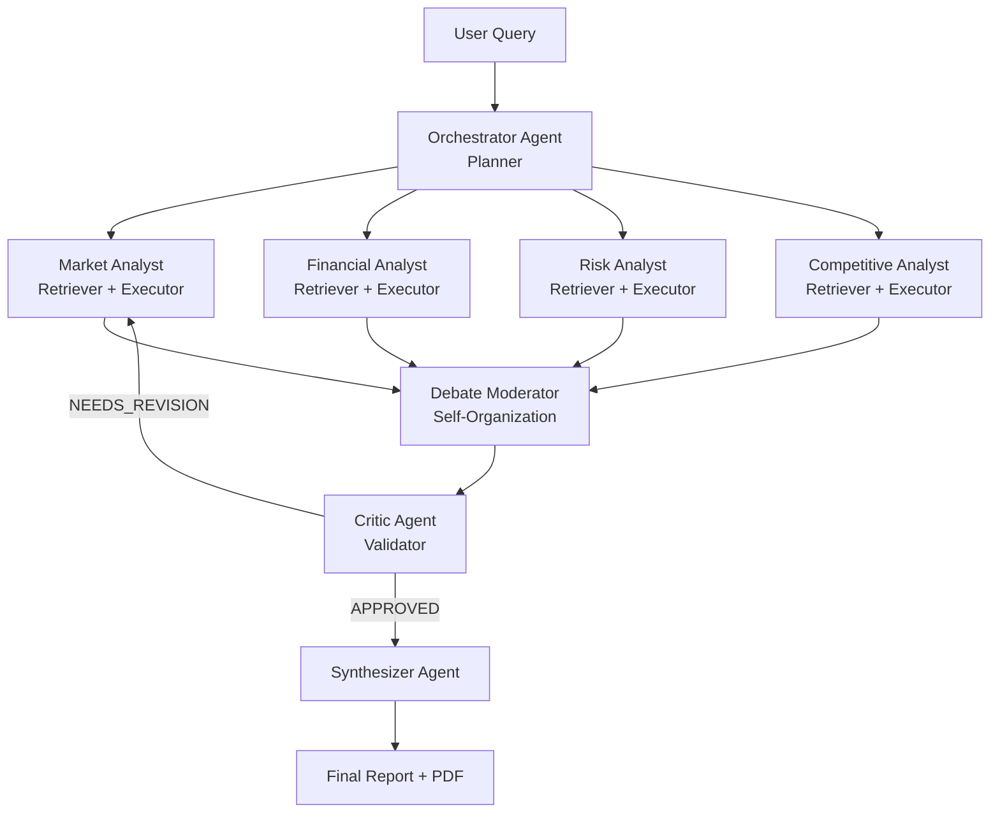

# SwarmIQ — AI-Powered Investment Research Swarm

> A swarm of 7 specialized AI agents that researches, debates, and synthesizes investment intelligence in under 60 seconds.

---

## Microsoft Build AI 2026 — Theme 05: Agent Swarms

SwarmIQ is built specifically for **Theme 05: Agent Swarms** — a system where multiple AI agents collaborate, self-organize, and collectively produce outputs no single agent could achieve alone. The mapping is explicit: the **Orchestrator** acts as the swarm planner (decomposes the query into directed sub-tasks), the four **Specialist Analysts** are retriever-executors (each searches and reasons independently in parallel), the **Debate Moderator** provides self-organization (surfaces conflicts between agents and forces consensus before escalation), and the **Critic** is the validator (adversarially reviews all outputs and triggers a revision loop when quality is insufficient).

---

## The Problem

- **Investment research is slow and expensive.** A professional equity research report takes 2–5 analyst-days and costs thousands of dollars — putting institutional-grade analysis out of reach for individual investors, early-stage founders, and small funds.
- **Single-perspective analysis is dangerously incomplete.** Most AI tools answer with one model, one viewpoint. Market opportunity, financial health, competitive threats, and regulatory risk require genuinely different reasoning lenses — and those lenses often conflict.
- **Conflicts between data sources go unresolved.** When one source says a company is growing and another flags its burn rate as unsustainable, a single-agent system has no mechanism to surface or resolve that contradiction. SwarmIQ does.

---

## Our Solution

SwarmIQ sends a user query through a structured, multi-stage swarm pipeline. First, the **Orchestrator** reads the query and decomposes it into four specialized research tasks — each crafted to elicit the right kind of analysis from the right kind of expert. Those four tasks are dispatched simultaneously to four **Specialist Analysts** (Market, Financial, Risk, and Competitive) who each run live web searches via Tavily and reason over the results independently. As specialist outputs complete, they are streamed live to the browser so users can watch the swarm think in real time.

Once all specialists finish, the **Debate Moderator** scans for contradictions between outputs — if the Market Analyst sees explosive growth while the Financial Analyst flags severe cash burn, that conflict is surfaced as a structured debate visible in the UI. The agents exchange points until a resolution is reached. The consolidated outputs then go to the **Critic** (powered by Semantic Kernel's `AgentGroupChat`) which adversarially reviews every claim: checking for contradictions, unsupported assertions, and suspicious gaps. If quality is insufficient, the Critic triggers a targeted revision — only the flagged specialists re-run, with explicit issue context. Finally, the **Synthesizer** writes a structured executive report with eight named sections, confidence scores, and agent attribution. The whole pipeline completes in under 60 seconds.

---

## Microsoft Stack Used

| Tool | How We Use It | Why It Matters |
|---|---|---|
| **GitHub Models** (`openai/gpt-4o-mini`) | Inference layer — powers all 7 agents via the OpenAI-compatible endpoint at `https://models.github.ai/inference`. GitHub is a Microsoft subsidiary; same underlying Azure OpenAI infrastructure, free student-tier-friendly access via a GitHub PAT | Microsoft-owned inference, no Azure OpenAI quota hurdle, drop-in swap to direct Azure OpenAI by changing three env vars (`LLM_BASE_URL`, `LLM_API_KEY`, `LLM_MODEL`) — **zero code changes** |
| **Azure OpenAI (fallback)** | `swarmiq-foundry-vp` provisioned in `swarmiq-rg` (Central India) as the production-grade alternative to GitHub Models. Switching requires deploying a model in that resource, then setting three env vars (`LLM_BASE_URL=https://swarmiq-foundry-vp.openai.azure.com/openai/v1`, `LLM_API_KEY`, `LLM_MODEL`) — **zero code changes**. Both `tools.py` and `sk_agents.py` read the same vars, so the entire 7-agent + SK pipeline switches in one config update | Azure OpenAI endpoint provisioned and verifiable in `swarmiq-rg`; we run on GitHub Models for the hackathon (no quota required), with this resource standing by for production scale |
| **Semantic Kernel** v1.x | `AgentGroupChat` orchestrates the **Critic ↔ Synthesizer finalization stage** — adversarial review, optional NEEDS_REVISION revision loop, and final markdown report generation. `ChatCompletionAgent` wraps each SK agent with structured instructions, configured with a custom `AsyncOpenAI` client so it runs against any OpenAI-compatible endpoint. The Orchestrator, four specialists, and Debate Moderator run on a raw OpenAI-compatible client — SK is deliberately scoped to the validation+synthesis loop, where its structured agent contract and group-chat protocol add the most value | Production-grade Microsoft orchestration framework on the most critical stage of the swarm — not a hand-rolled validation loop. Transparent to whichever inference endpoint is wired |
| **Azure Cosmos DB** | Stores per-user analysis history (MongoDB-compatible API, accessed via Motor async driver) | Serverless, globally distributed, scales to zero — no cold-start cost |
| **Azure Container Apps** | Production hosting target — two app replicas, shared Redis sidecar, auto-scaling to zero | No infrastructure management; built-in HTTPS, custom domains, scaling |
| **Azure Key Vault** | Stores all **thirteen** application secrets (LLM endpoint, LLM API key, model name, Tavily, Redis URL, three Entra creds, two Cosmos string + db name, plus three Gmail SMTP creds for the "Email me the report" feature). The Container App reads each via managed-identity Key Vault references — no secrets in git, no secrets in env files in CI | Zero-trust secret hygiene; rotating a secret = one CLI call, no redeploy |
| **GitHub Actions** | CI/CD pipeline at `.github/workflows/azure-deploy.yml` builds the image, pushes to ACR, updates the Container App revision on every push to `main` | Hands-off deploy; the live URL stays in sync with the repo |
| **Microsoft Entra External ID** | MSAL.js popup auth; ID tokens validated server-side via JWKS; `oid` claim used as stable user key | Standards-based identity with no password management or user table |

---

## Architecture



**Runtime flow:**
1. Browser opens a per-session WebSocket (`/ws/{sid}`)
2. `POST /analyze` fires; FastAPI dispatches the swarm pipeline
3. Orchestrator decomposes the query → 4 specialist tasks in parallel (`asyncio.gather`)
4. Each specialist: 2× Tavily web searches → LLM reasoning (GitHub Models gpt-4o-mini) → structured JSON result
5. Debate Moderator scans for conflicts → emits debate turns over WebSocket
6. Semantic Kernel `AgentGroupChat`: Critic reviews → optional revision loop → Synthesizer writes report
7. Full result cached in Redis for 24 hours (keyed by `sha256(query)`)
8. If authenticated, analysis saved to Cosmos DB under the user's Entra `oid`

---

## Agent Roles

| Agent | Swarm Taxonomy | Responsibility |
|---|---|---|
| **Orchestrator** | Planner | Reads the raw query; returns four targeted sub-task strings for the specialists via gpt-4o-mini (JSON mode) |
| **Market Analyst** | Retriever + Executor | Tavily search (market size, growth, positioning) → LLM analysis → `{findings, key_metrics, sources, confidence}` |
| **Financial Analyst** | Retriever + Executor | Tavily search (funding, revenue, burn, valuation) → LLM analysis → structured JSON |
| **Risk Analyst** | Retriever + Executor | Tavily search (lawsuits, regulation, controversies) → LLM analysis → `{risks, overall_risk, confidence}` |
| **Competitive Analyst** | Retriever + Executor | Tavily search (competitors, market position, moats) → LLM analysis → `{competitors, competitive_position}` |
| **Debate Moderator** | Self-Organization | Scans all four specialist outputs for contradictions; runs structured debate turns until resolution; result passed to Critic |
| **Critic** | Validator | Semantic Kernel `ChatCompletionAgent`; adversarial JSON review; triggers targeted revision loop (max 1 pass) if `NEEDS_REVISION` |
| **Synthesizer** | Reporter | Semantic Kernel `ChatCompletionAgent`; writes final 8-section markdown report with confidence scores and agent attribution |

---

## Live Demo

**Deployed App:** [**swarmiq.vaaniprashar.tech**](https://swarmiq.vaaniprashar.tech)

Hosted on Azure Container Apps in `centralindia`, custom domain via Cloudflare DNS, TLS via ACA managed certificate. Backed by Upstash Redis for query-result caching, Azure Key Vault for all secrets, and a GitHub Actions CI/CD pipeline that auto-deploys on every push to `main`.

**No login required** — anonymous users get the full research experience including the swarm, debate, critic revision loop, and PDF export. Sign in with any Microsoft account (Outlook, Hotmail, Live, work, school) to surface the sign-in flow; analysis history is currently persisted in browser localStorage (Cosmos DB integration is wired in code and ready to enable via a single Key Vault secret update).

---

## Setup Instructions

### Prerequisites

- Python 3.11+
- Docker + Docker Compose (recommended for local run)
- A **GitHub Personal Access Token** with the `Models: Read-only` scope ([generate one here](https://github.com/settings/tokens?type=beta) → Permissions → Account → Models). This is the LLM inference credential by default.
- A **Tavily** API key (free at [app.tavily.com](https://app.tavily.com))

> Optional: an **Azure OpenAI** deployment if you want to swap to direct Azure inference instead of GitHub Models — set `LLM_BASE_URL=https://YOUR-RESOURCE.openai.azure.com/openai/v1`, `LLM_API_KEY`, and `LLM_MODEL=YOUR-DEPLOYMENT-NAME` in `.env`. No code change needed.

### Option A — Docker Compose (recommended)

Runs the app + Redis in one command. No Python environment needed.

```bash
# 1. Clone
git clone https://github.com/vaani1127/swarmIQ.git
cd swarmIQ

# 2. Create your .env file
cp .env.example .env
# Edit .env — fill in LLM_API_KEY (your GitHub PAT) and TAVILY_API_KEY at minimum
# Entra and Cosmos DB vars are optional; app works fully without them

# 3. Run
docker-compose up --build

# 4. Open
# → http://localhost:8000
```

### Production — Azure Container Apps

Production deployment to Azure Container Apps — see [azure-resources.sh](azure-resources.sh) for one-time infrastructure setup and [.github/workflows/azure-deploy.yml](.github/workflows/azure-deploy.yml) for the CI/CD pipeline (triggers on push to `main`).

### Option B — Python venv

```bash
# 1. Clone and enter the repo
git clone https://github.com/vaani1127/swarmIQ.git
cd swarmIQ

# 2. Create virtual environment
python -m venv venv

# Windows
.\venv\Scripts\Activate.ps1
# macOS / Linux
source venv/bin/activate

# 3. Install dependencies
pip install -r requirements.txt

# 4. Configure
cp .env.example .env
# Edit .env with your credentials

# 5. Start Redis (required for session dedup and caching)
docker run -d -p 6379:6379 redis:7-alpine

# 6. Run
python -m backend.main
# → http://localhost:8000
```

---

## Environment Variables

| Variable | Required | Description | Where to get it |
|---|---|---|---|
| `LLM_BASE_URL` | **Yes** | OpenAI-compatible inference endpoint. Default: `https://models.github.ai/inference` (GitHub Models). For Azure OpenAI use `https://YOUR-RESOURCE.openai.azure.com/openai/v1` | Default is fine for GitHub Models; otherwise your resource URL |
| `LLM_API_KEY` | **Yes** | Inference credential. For GitHub Models: a GitHub PAT with `Models: Read-only` scope. For Azure OpenAI: the resource API key | [GitHub PAT settings](https://github.com/settings/tokens?type=beta) or Azure Portal → Keys and Endpoint |
| `LLM_MODEL` | **Yes** | Model identifier. Default: `openai/gpt-4o-mini`. For Azure OpenAI use your deployment name | GitHub Models marketplace or Azure OpenAI deployments page |
| `GITHUB_TOKEN` | Optional | Alias accepted as a fallback for `LLM_API_KEY` (some CI runners set this automatically) | Same as `LLM_API_KEY` |
| `TAVILY_API_KEY` | **Yes** | Web search API key | [app.tavily.com](https://app.tavily.com) — free, 1 000 searches/month |
| `REDIS_URL` | **Yes** | Redis connection URL | `redis://localhost:6379` locally; set automatically by docker-compose |
| `AZURE_AD_TENANT_ID` | Optional | Entra tenant ID (enables auth) | Azure Portal → Microsoft Entra ID → Overview |
| `AZURE_AD_CLIENT_ID` | Optional | App registration client ID | Azure Portal → Entra ID → App registrations → your app |
| `AZURE_AD_CLIENT_SECRET` | Optional | App registration client secret | Azure Portal → App registrations → Certificates & secrets |
| `COSMOS_DB_CONNECTION_STRING` | Optional | MongoDB-compatible connection string | Azure Portal → Cosmos DB account → Connection strings |
| `COSMOS_DB_DATABASE_NAME` | Optional | Database name (default: `swarmiq`) | Your choice; must match the Cosmos DB database you create |

> **Auth and history are optional.** If the Entra and Cosmos DB variables are omitted, the app runs fully as anonymous — all research features work, analyses just aren't persisted.

---

## Team

| Name | Role | GitHub |
|---|---|---|
| Dhruv Goyal | Product, Azure deployment, demo narrative, submission operations | [@DhruvGoyal404](https://github.com/DhruvGoyal404) |
| Vaani Prashar | Full-stack — agent architecture, Semantic Kernel integration, frontend | [@vaani1127](https://github.com/vaani1127) |
| Madhav Kapila | Full-stack — backend & integration | [@madhavkapila](https://github.com/madhavkapila) |

---

## AI Tools Disclosure

*Required by hackathon rules. All AI-assisted development is disclosed below.*

| Tool | Version | How it was used |
|---|---|---|
| **GitHub Copilot** | Team IDE assistant | Code completion and small in-editor implementation suggestions during development |
| **Claude Code** (Anthropic) | claude-sonnet-4-6 | Primary development assistant — architecture design, agent implementation, Semantic Kernel integration, auth/Cosmos DB plumbing, frontend auth + history UI, README |
| **GitHub Models** (`openai/gpt-4o-mini`) | OpenAI-compatible API at `https://models.github.ai/inference` | Runtime LLM — powers all 7 agents inside SwarmIQ itself (not used to write SwarmIQ's code). Microsoft-owned inference, OpenAI-compatible, drop-in swap to direct Azure OpenAI via `LLM_BASE_URL` env var |

---

## License

MIT — see [LICENSE](LICENSE).
